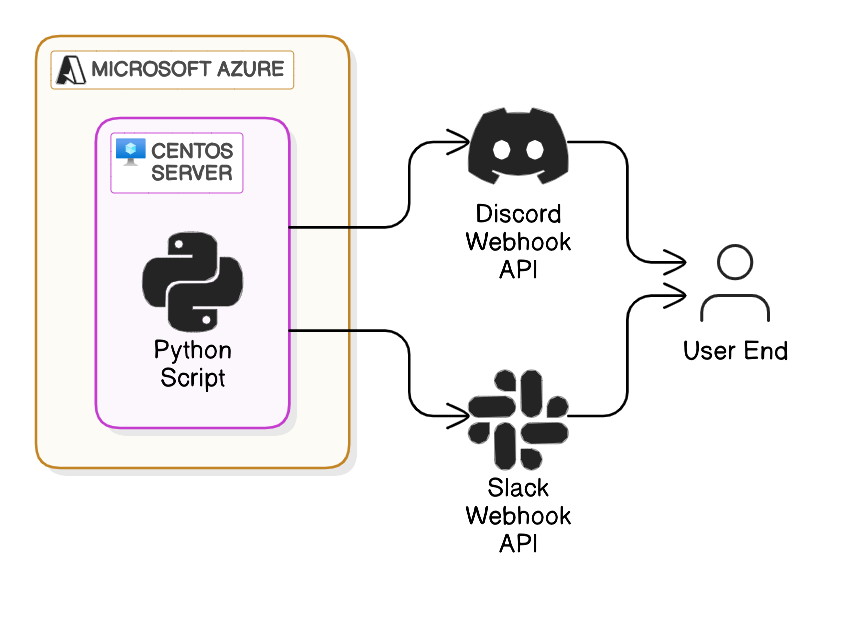

# Inventrack
Inventrack is a Python-based SaaS designed to deliver push notifications to end users via Discord and Slack APIs. It leverages the requests library for HTTP interactions and BeautifulSoup for efficient web scraping and data parsing. Hosted on a CentOS server and cloud-deployed through Microsoft Azure, the system ensures scalability, reliability, and seamless integration with messaging platforms. By combining robust backend logic with real-time API communication, it offers a streamlined solution for efficient data processing and delivery. Below is a brief diagram of the program's architecture.

## Credits
The full-stack code, server management, cloud hosting, and the website www.inventrack.org were all created and implemented by Luke Campbell.
